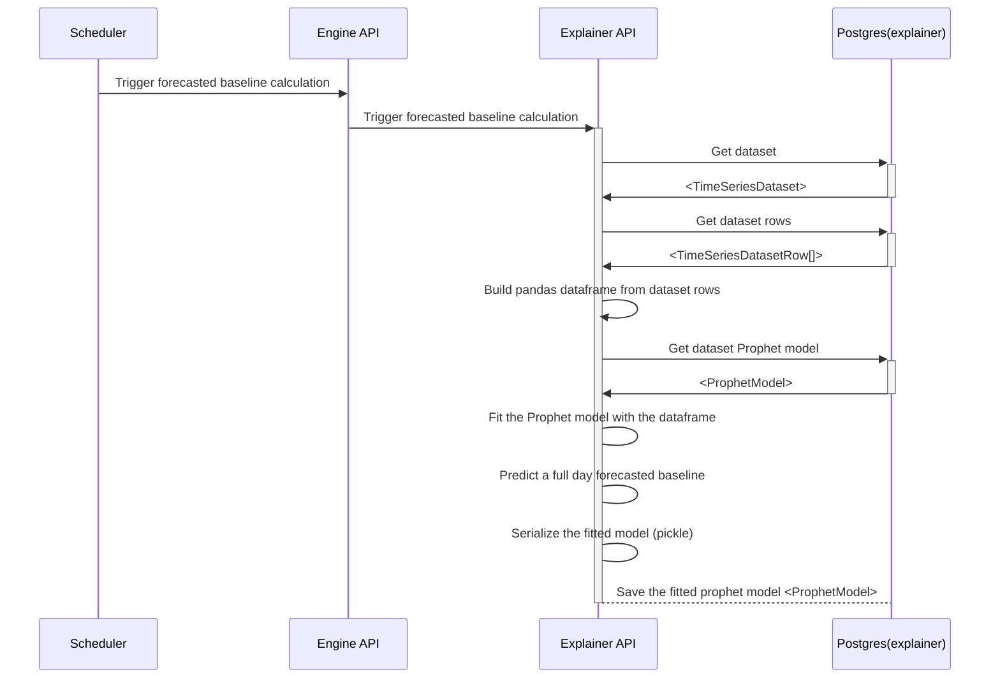

# Mermaid example

```mermaid
sequenceDiagram
  Scheduler ->> Engine API: Trigger forecasted baseline calculation
  Engine API ->>+ Explainer API: Trigger forecasted baseline calculation
  Explainer API ->>+ Postgres(explainer): Get dataset
  Postgres(explainer) ->>- Explainer API: <TimeSeriesDataset>

  Explainer API ->>+ Postgres(explainer): Get dataset rows
  Postgres(explainer) ->>- Explainer API: <TimeSeriesDatasetRow[]>
  Explainer API ->> Explainer API: Build pandas dataframe from dataset rows

  Explainer API ->>+ Postgres(explainer): Get dataset Prophet model
  Postgres(explainer) ->>- Explainer API: <ProphetModel>

  Explainer API -> Explainer API: Fit the Prophet model with the dataframe
  Explainer API -> Explainer API: Predict a full day forecasted baseline
  Explainer API -> Explainer API: Serialize the fitted model (pickle)
  Explainer API --> Postgres(explainer): Save the fitted prophet model <ProphetModel>
  deactivate Explainer API
```
