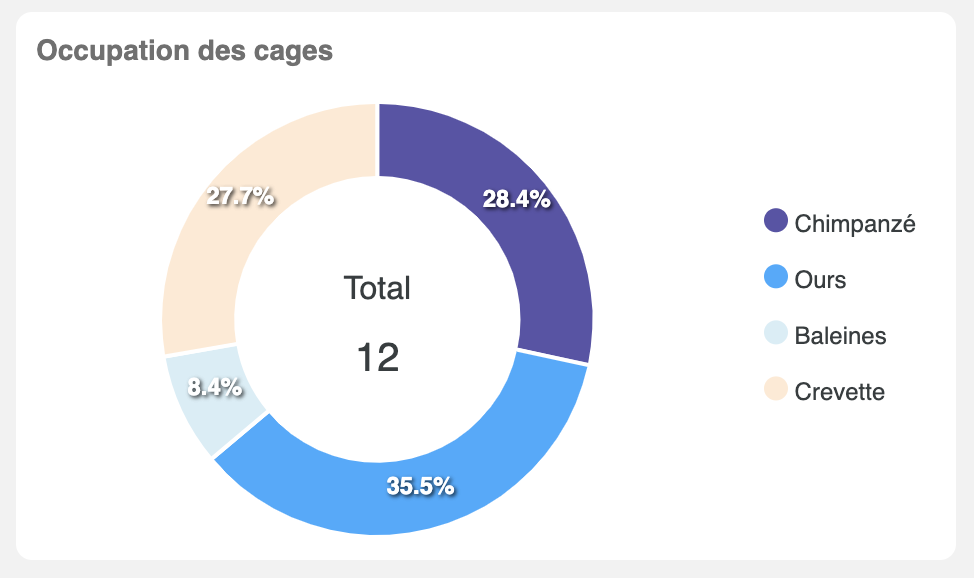
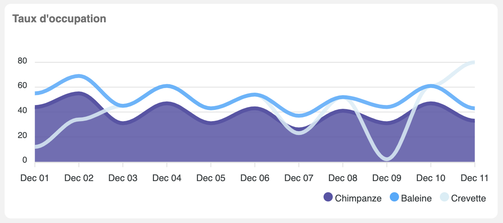

# Chart components

## donut-chart-component

[](img/donut-chart-example.png)

This component waiting for several arguments :

| Name | Type | Description | optional |
|-------|------------|-----|-----------|
| `data` | `number[]` | Set of data | false |
| `labels` | `string[]` | Label for wich element of the data set | false |
| `title` | `string` | Graph's title | true |
| `globalLabel` | `string` | Label display on the center of donut | true |
| `hideLabel` | `boolean` | hide label | true |
| `labelClickEmitter` | `(label: string) => void` | function who catch user click on label | true |

```typescript tab="Typescript"

```

```html tab="HTML"
<app-donut-chart
    [data]="dataDonut"
    globalLabel="total"
    [labels]="labelsDonut"
    [title]="titleDonut"
    hideLabel="true"
    (labelClickEmitter)="actionOnLabelClick($event)">
</app-donut-chart>
```

## line-chart-component

[](img/line-chart-example.png)

This component waiting for several arguments :

| Name | Type | Description | optional |
|-------|------------|-----|-----------|
| `series` | `Serie[]` | Set of data | false |
| `title` | `string` | Graph's title | true |

```typescript
export interface Serie {
    name: string;
    type: 'area' | 'line';
    data: number[];
}
```

One chart example with area and line series combined:

```typescript tab="Typescript"
public series = [
    {
        name: 'Chimpanze',
        type: 'area',
        data: [44, 55, 31, 47, 31, 43, 26, 41, 31, 47, 33]
    },
    {
        name: 'Baleine',
        type: 'line',
        data: [55, 69, 45, 61, 43, 54, 37, 52, 44, 61, 43]
    }
];
```

```html tab="HTML"
<app-line-chart
    *ngIf="series"
    [title]="titleLine"
    [series]="series">
</app-line-chart>
```
