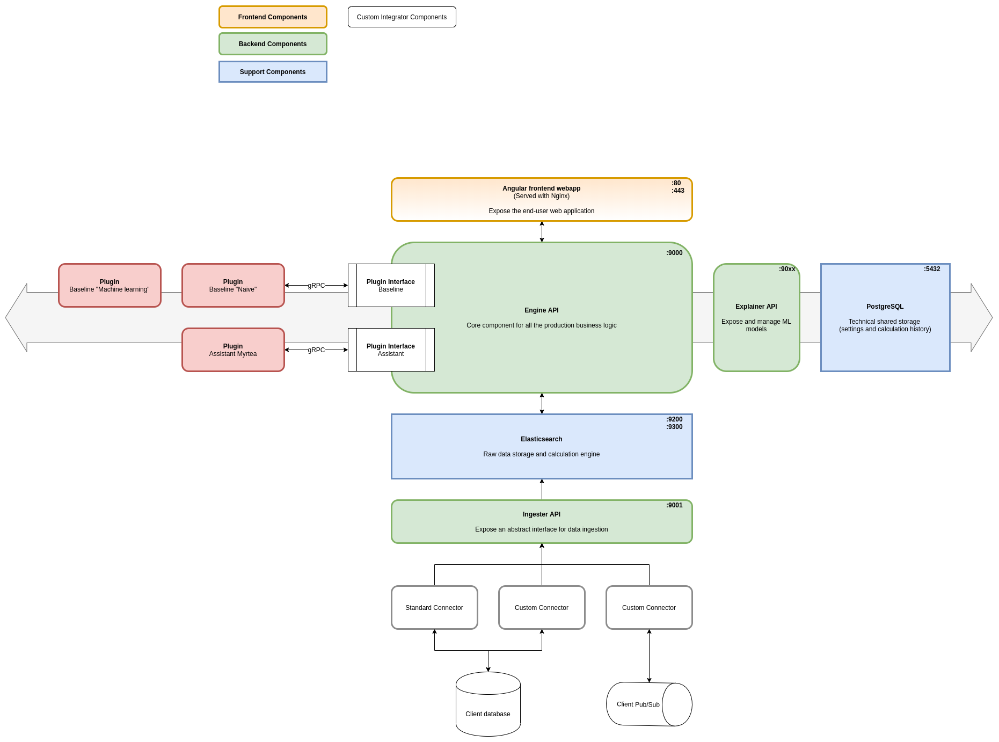

# Architecture

## Internal components

| Component       | Ownership | Technology                         | Default exposed port |
| --------------- | --------- | ---------------------------------- | -------------------- |
| Engine-API      | Internal  | Go (1.14)                          | 9000                 |
| Ingester-API    | Internal  | Go (1.14)                          | 9001                 |
| Explainer-API   | Internal  | Python (3.6)                       | 9005                 |
| Web Interface   | Internal  | Angular (8.0) served by Nginx      | 80, 443              |
| Connectors      | Internal  | Multiple options (Go, Python, ...) | N/A                  |

## Internal or Provided components

| Component     | Ownership              | Technology        | Default exposed port |
| ------------- | ---------------------- | ----------------- | ------------ |
| Elasticsearch | Internal (or provided) | Elasticsearch 6.x | 9200, 9300   |
| PostgreSQL    | Internal (or provided) | PostgreSQL        | 5432         |

## External components

| Component              | Ownership            | Technology      | Default exposed port |
| ---------------------- | -------------------- | --------------- | ------------ |
| Customer Oracle DB     | External             | Oracle          | 1521         |
| Customer Kafka Brokers | External             | Kafka           | 9092         |
