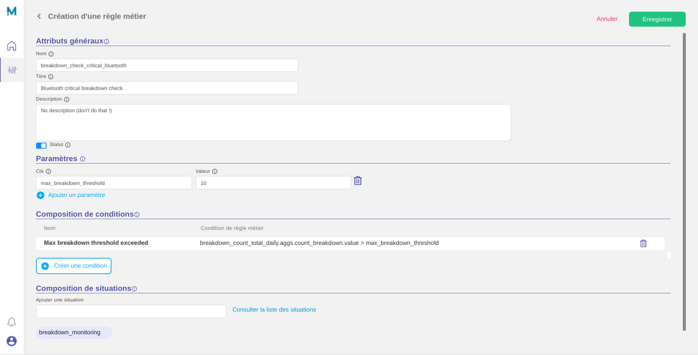
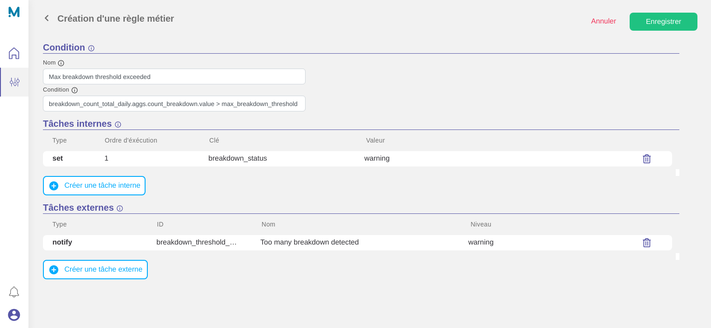
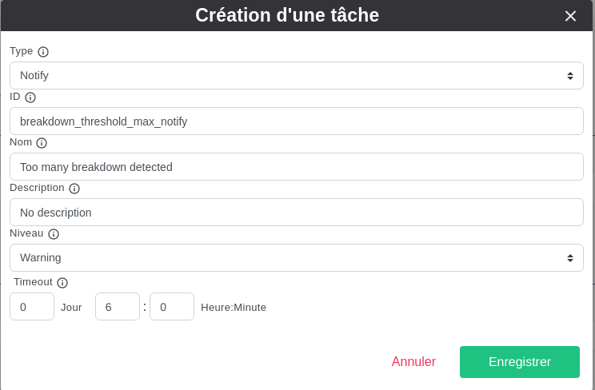
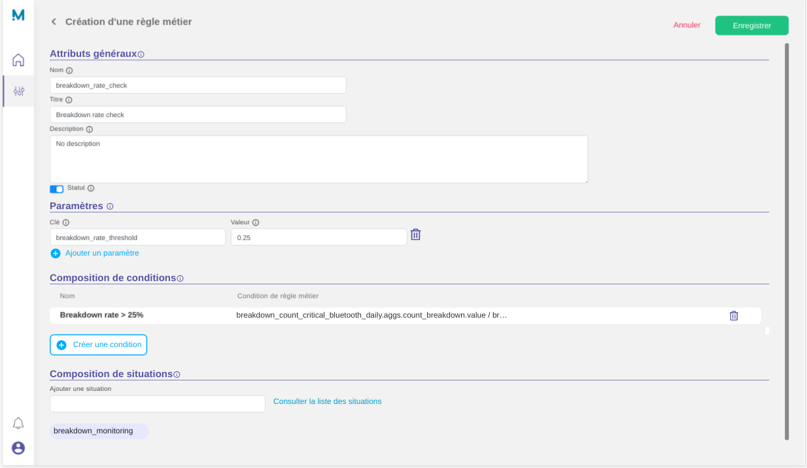
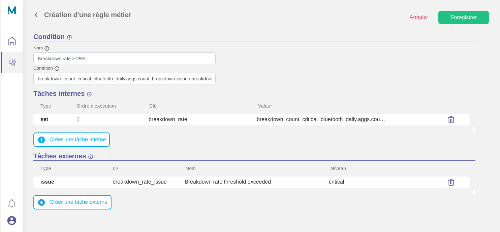
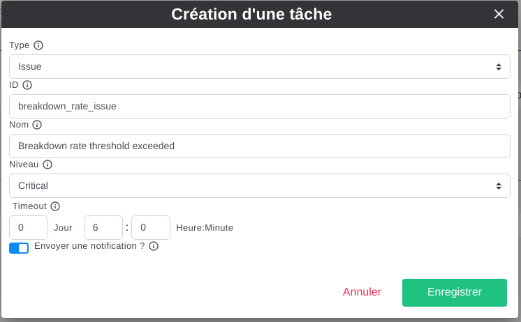

# Rules creation

We now have two clean facts, regrouped in a dedicated situation `breakdown_monitoring`.

At this moment, situation's facts can be calculated, queried and displayed using some specific APIs.

But in most business context, we want to trigger some notifications or alerts in case something wrong (or good !) happened.

## Settings

In our context, we want to create two rules based on the following specifications :

### First rule

Our first rule will check if the number of critical breakdown on the bluetooth component doesn't exceed a specific threshold (10).
In case the threshold is exceeded, we want to be notified with a warning. In case the threshold is exceeded multiple time in a row, we only want 1 notify in a window of 6 hours.

**Expected settings** :

* Name : `breakdown_check_critical_bluetooth`
* Parameters : `max_breakdown_threshold` = `10`
* 1 group of condition composed of :
    * A condition : `breakdown_count_total_daily.aggs.count_breakdown.value > max_breakdown_threshold`
    * 1 Set task : `breakdown_status` = `warning`
    * 1 Issue task : `Too many breakdown detected` with level `warning` and a timeout of `6h`

### Second rule

Our second rule will check if the rate of critical breakdown on the bluetooth component doesn't exceed a specific threahold (25%).
In case the threshold is exceeded, we want to raise a critical issue in Myrtea and to be notified. In case the threshold is exceeded multiple time in a row, we only want 1 notify in a window of 3 hours.

The rate of critical breakdown is calculated with the following formula :

```math
breakdown_count_critical_bluetooth_daily / breakdown_count_total_daily
```

**Expected settings** :

* Name : `breakdown_check_critical_bluetooth`
* Parameters : `breakdown_rate_threshold` = `0.25`
* 1 group of condition composed of :
    * A condition : `breakdown_count_critical_bluetooth_daily.aggs.count_breakdown.value / breakdown_count_total_daily.aggs.count_breakdown.value > breakdown_rate_threshold`
    * 1 Set task : `breakdown_rate` = `breakdown_count_critical_bluetooth_daily.aggs.count_breakdown.value / breakdown_count_total_daily.aggs.count_breakdown.value`
    * 1 Issue task : `Breakdown rate threshold exceeded` with level `warning` and a timeout of `3h`


## Result Rule 1

* **Overview**



* **Condition**



* **Notify Task**



??? Question "Want to use the JSON API ?"

    ```json tab="POST /api/v4/engine/rules"
    {
        "enabled": true,
        "name": "breakdown_check_critical_bluetooth",
        "title": "Bluetooth critical breakdown check",
        "description": "No description (don't do that !)",
        "parameters": {
            "max_breakdown_threshold": "10"
        },
        "cases": [
            {
                "index": 0,
                "name": "Max breakdown threshold exceeded",
                "condition": "breakdown_count_total_daily.aggs.count_breakdown.value > max_breakdown_threshold",
                "tasks": [
                    {
                        "index": 0,
                        "type": "set",
                        "task": {
                            "key": "breakdown_status",
                            "value": "warning"
                        }
                    },
                    {
                        "index": 1,
                        "type": "notify",
                        "task": {
                            "id": "breakdown_threshold_max_notify",
                            "name": "Too many breakdown detected",
                            "description": "No description",
                            "level": "warning",
                            "timeout": "6h"
                        }
                    }
                ]
            }
        ]
    }
    ```

    ```json tab="POST /api/v4/engine/rules/1/situations"
    [1]
    ```

## Result Rule 2

* **Overview**



* **Condition**



* **Issue Task**



??? Question "Want to use the JSON API ?"

    ```json tab="POST /api/v4/engine/rules"
    {
        "cases": [
            {
                "index": 0,
                "name": "Breakdown rate > 25%",
                "condition": "breakdown_count_critical_bluetooth_daily.aggs.count_breakdown.value / breakdown_count_total_daily.aggs.count_breakdown.value > breakdown_rate_threshold",
                "tasks": [
                    {
                        "index": 0,
                        "type": "set",
                        "task": {
                            "key": "breakdown_rate",
                            "value": "breakdown_count_critical_bluetooth_daily.aggs.count_breakdown.value / breakdown_count_total_daily.aggs.count_breakdown.value"
                        }
                    },
                    {
                        "index": 1,
                        "type": "issue",
                        "task": {
                            "id": "breakdown_rate_issue",
                            "name": "Breakdown rate threshold exceeded",
                            "level": "critical",
                            "timeout": "3h",
                            "isNotification": true
                        }
                    }
                ]
            }
        ],
        "name": "breakdown_rate_check",
        "description": "No description",
        "title": "Breakdown rate check",
        "enabled": true,
        "parameters": {
            "breakdown_rate_threshold": "0.25"
        }
    }
    ```

    ```json tab="POST /api/v4/engine/rules/2/situations"
    [1]
    ```
