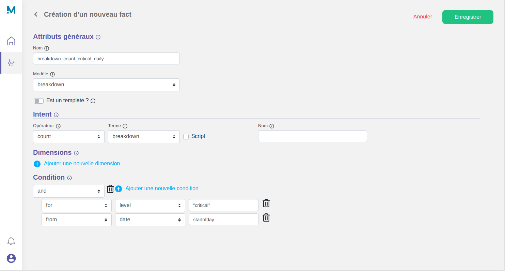
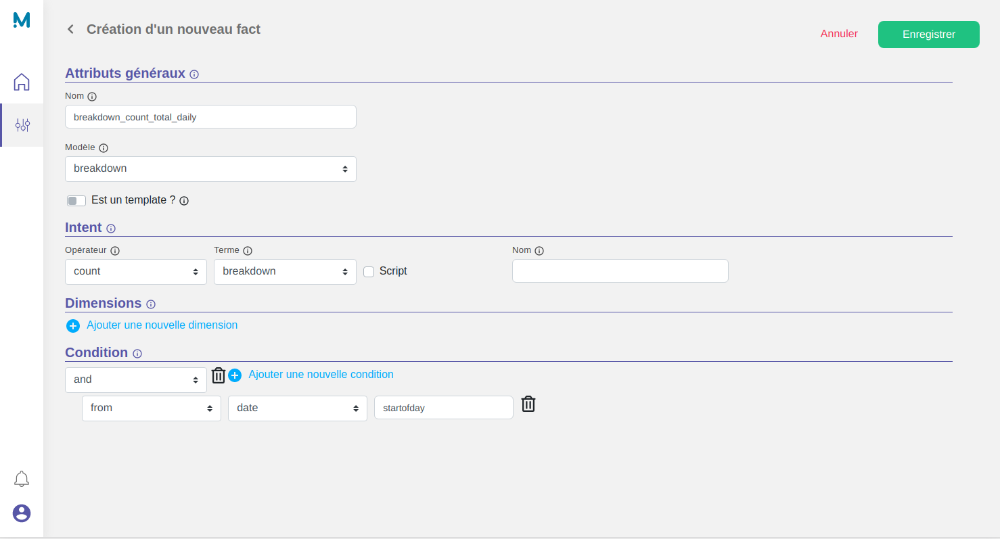

# Facts creation

Now that we have indexed some data in our `breakdown` **model,** we can now start to tackle the most important parts, setting up a few **facts**.

You can refer to the dedicated section [Fact settings](/settings/fact) for more informations.

## Settings

Let's create a first fact named `breakdown_count_total_daily`.
As the name suggests it, this fact will count the total number breakdown for the current day.

* A model : `breakdown`
* An intent : `count` + `breakdown`
* (No dimension)
* A condition :
  * `From` ( `date` : `startofday` )

And a second fact named `breakdown_count_critical_bluetooth_daily`.
As the name suggests it, this fact will count the number of critical breakdown, for the component "bluetooth", for the current day.

* A model : `breakdown`
* An intent : `count` + `breakdown`
* (No dimension)
* A condition :
    * `And`
        * `For` ( `level` : `"critical"`)
        * `For` ( `component` : `"bluetooth"` )
        * `From` ( `date` : `startofday` )

!!! note
    The words `"critical"` and `"bluetooth"` are wrapped with double-quote on purpose. In this context, they are used as strings, not as variables, and thus should be wrapped.

    The special token `startofday` allow to specify a date relative to the calculation date (in this case, the start of the current day).

## Results

* Fact `breakdown_count_critical_bluetooth_daily`



??? Question "Want to use the JSON API ?"

    ```json tab="POST /api/v4/engine/facts"
    {}
    ```

* Fact `breakdown_count_total_daily`



??? Question "Want to use the JSON API ?"

    ```json tab="POST /api/v4/engine/facts"
    {}
    ```
