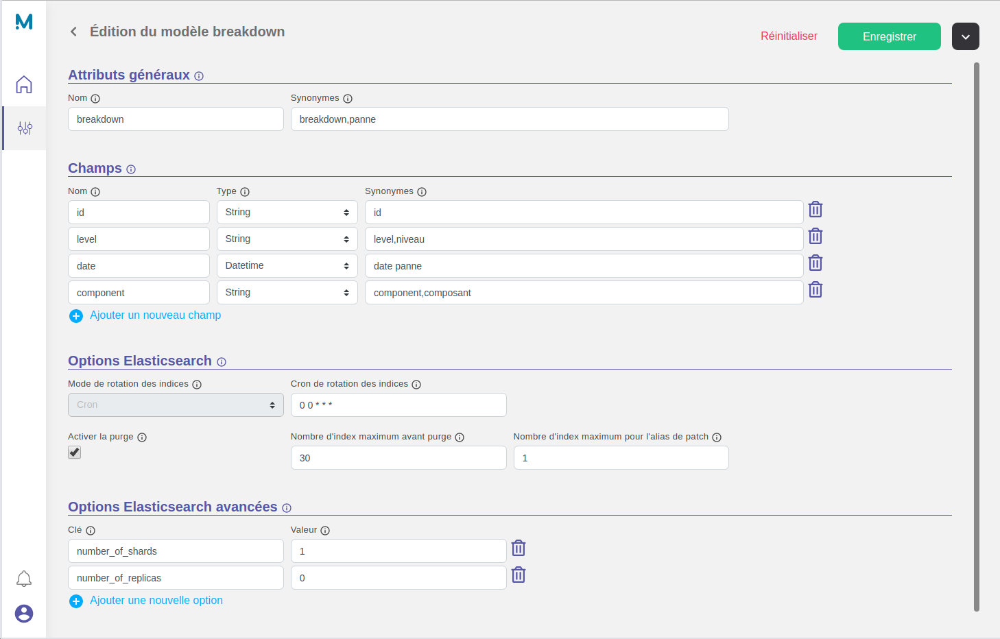

# Create a new model

Before doing anything, it's important to understand that many components in the product are scopped by **model**. It is one of the segregation unit available to split the application content.

You can refer to the dedicated section [Model settings](/settings/model) for more informations.

## Settings

Now, let's create a new model named `breakdown` with the following fields :

* String `id`
* String `level`
* Datetime `date`
* String `component`

We want to keep 30 days of data history, with a daily index rotation :

* Cron expression : `0 0 * * *` (Rotate the index once per day at midnight)
* Activate purge : `true` (Purge indices after a specific period of time)
* Indices rention before purge : `30` (days)
* Patch alias indices : `1` (days)

## Result



??? Question "Want to use the JSON API ?"

    ```json tab="POST /api/v4/modeler/models"
    {
        "name": "breakdown",
        "synonyms": [ "breakdown", "panne" ],
        "fields": [
            {
                "name": "id",
                "type": "string",
                "synonyms": [ "id" ]
            },
            {
                "name": "level",
                "type": "string",
                "synonyms": [ "level", "niveau" ]
            },
            {
                "name": "date",
                "type": "datetime",
                "synonyms": [ "date panne" ]
            },
            {
                "name": "component",
                "type": "string",
                "synonyms": [ "component", "composant" ]
            }
        ],
        "elasticsearchOptions": {
            "rollmode": "cron",
            "rollcron": "0 0 * * *",
            "enablePurge": true,
            "purgeMaxConcurrentIndices": 30,
            "patchAliasMaxIndices": 1,
            "advancedSettings": {
                "number_of_replicas": "0",
                "number_of_shards": "1"
            }
        }
    }
    ```
