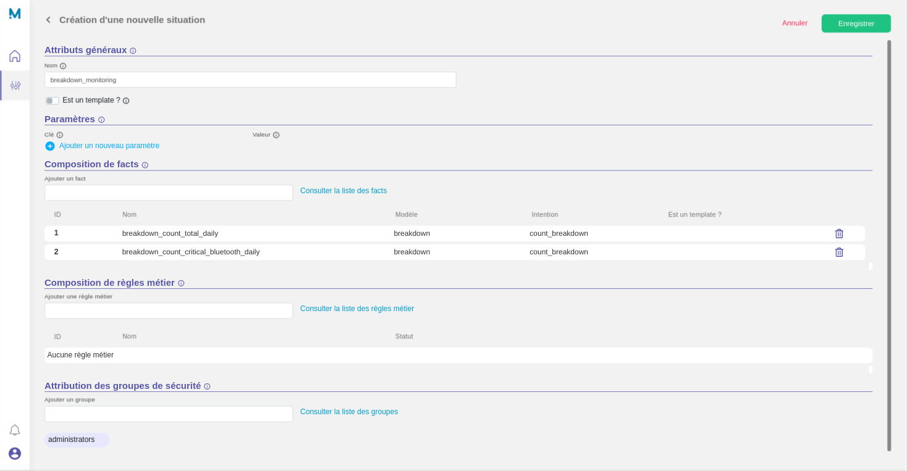

# Situation creation

Now that we have indexed created some **facts**, we can create a logical regroupment for them, using a **situation**.

You can refer to the dedicated section [Situation settings](/settings/situation) for more informations.

## Settings

For now, we will only create a basic situation `breakdown_monitoring` with the two previously created **facts**.

To prevent any access issue, we will also affect this situation to the default **user group** `administrators`.

## Results

* Situation `breakdown_monitoring`



??? Question "Want to use the JSON API ?"

    `POST /api/v4/engine/situations`
    ```json
    {
        "name": "breakdown_monitoring",
        "isTemplate": false,
        "parameters": {},
        "facts": [
            1,
            2
        ],
        "groups": [
            1
        ]
    }
    ```
