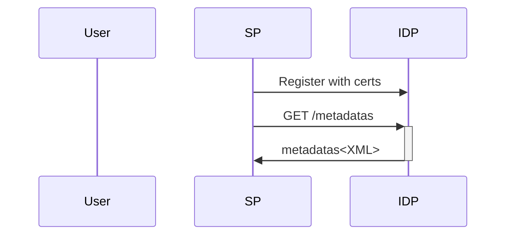
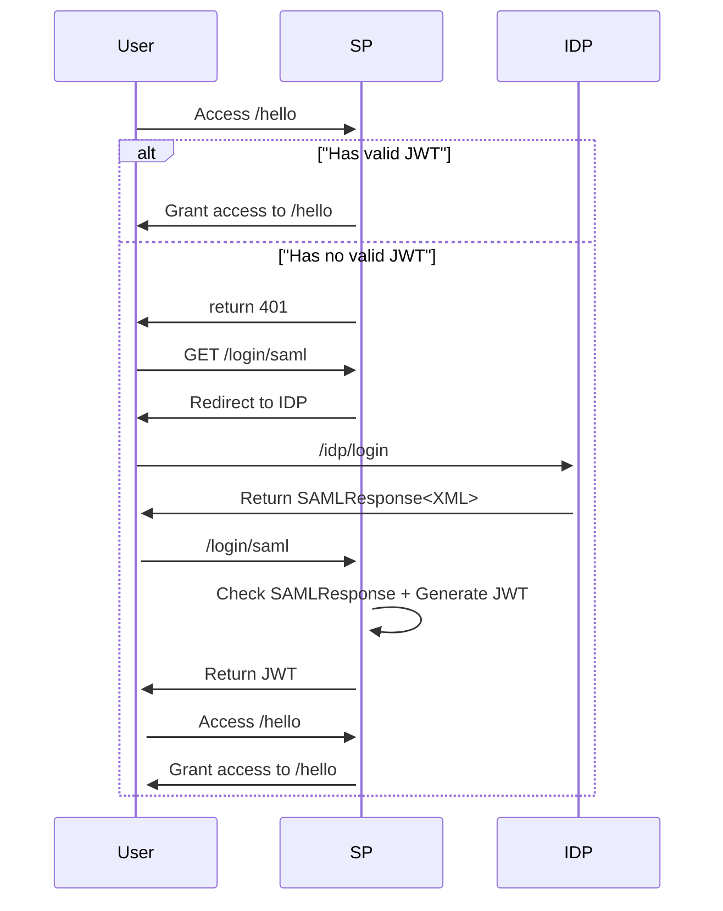

# SAML authentication

## Service provider registration

```mermaid
sequenceDiagram
  participant User
  participant SP
  participant IDP

  SP ->> IDP: Register with certs
  SP ->>+ IDP: GET /metadatas
  IDP ->>- SP: metadatas<XML>
```

 

## Login process

```mermaid
sequenceDiagram
  User ->>+ SP: Access /hello

  alt "Has valid JWT"
    SP ->> User: Grant access to /hello

  else "Has no valid JWT"
    SP ->> User: return 401
    User ->> SP: GET /login/saml
    SP ->> User: Redirect to IDP
    User ->>+ IDP: /idp/login
    IDP ->>+ User: Return SAMLResponse<XML>
    User ->>+ SP: /login/saml
    SP ->>+ SP: Check SAMLResponse + Generate JWT
    SP ->>+ User: Return JWT
    User ->>+ SP: Access /hello
    SP ->> User: Grant access to /hello
  end
```
